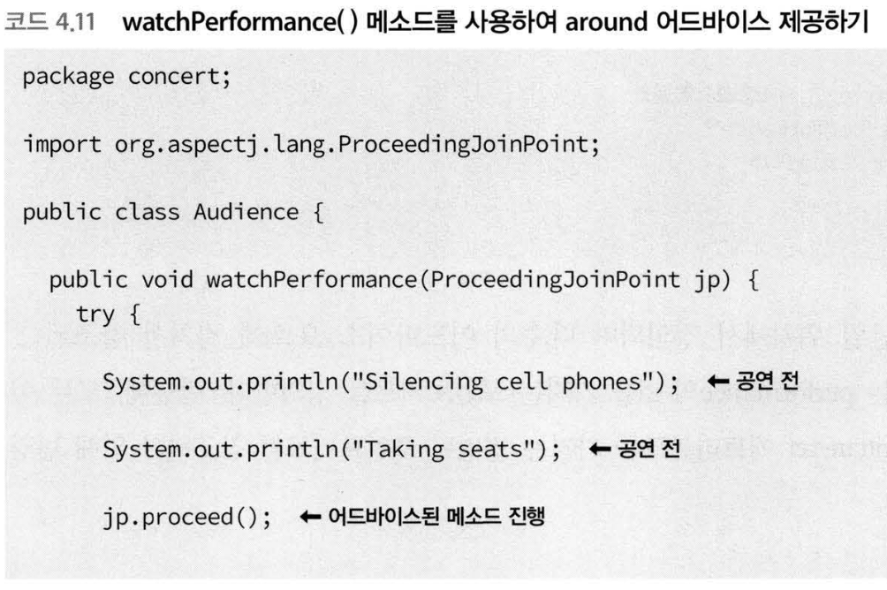

[TOC]

# Spring In Action

## 1장. 스프링 속으로
* POJO(Plain Old Java object)
* DI(Dependency Injection, 종속객체 주입)
	* 적용 전
	```java
        public class DamselRescuingKnight implements Knight {
          private RescueDamselQuest quest;

          public DamselRescuingKnight() {
            this.quest = new RescueDamselQuest();
          }

          public void embarkOnQuest() {
            quest.embark();
          }
        }
    ```
    * 적용 후
    ```java
        public class BraveKnight implements Knight {
          private Quest quest;

          public BraveKnight(Quest quest) {
            this.quest = quest;
          }

          public void embarkOnQuest() {
            quest.embark();
          }
        }
    ```

---

## 2장 빈 와이어링(묶기)
* `<constructor-arg>` : c-네임스페이스
* `<property>` : p-네임스페이스

```java
// 명명규칙
// -ref는 빈 참조 주입
// p-네임스페이스의 접두어:프로퍼티명-ref="주입할 빈의 ID"
p:compactDisc-ref="compactDisc"

// -ref가 없으면 빈을 참조하지 않고 리터럴 값을 와이어링한다.
p:artist="The Beatles"
```

* 컬렉션을 와이어링할 때는 p-네임스페이스를 사용할 수 없다.
* 대신 util-네임스페이스를 사용할 수 있다.
* `<util:list>`는 리스트 빈을 만드므로, p-네임스페이스를 사용할 때 다른 빈처럼 -ref를 사용하여 와이어링한다.
* util-네임스페이스의 종류
	* `<util:constant>`
	* `<util:list>`
	* `<util:map>`
	* `<util:properties>`
	* `<util:property-path>`
	* `<util:set>`

---

## 3장 고급 와이어링
> 개발/생산/QA 환경에 따라 DataSource 빈을 생성, 설정을 다르게 하거나,

> 개별 구성 클래스(또는 XML파일)에서 각 빈을 구성하고, 애플리케이션 배치 컴파일(Maven 프로파일을 사용 등)을 빌드 타임에 결정하는 방법을 이용할 수 있다.

* 개발 환경에서의 테스트 데이터를 미리 로드한 내장 데이터베이스 사용 방법
```java
@Bean(destroyMethod = "shutdown")
  public DataSource embeddedDataSource() {
    return new EmbeddedDatabaseBuilder()
        .setType(EmbeddedDatabaseType.H2)
        .addScript("classpath:schema.sql")
        .addScript("classpath:test-data.sql")
        .build();
  }
```

* 생산 환경에서는 JNDI를 사용하여 컨테이너에서 database를 얻는 방법을 이용
```java
@Bean
public DataSource jndiDataSource() {
    JndiObjectFactoryBean jndiObjectFactoryBean = new JndiObjectFactoryBean();
    jndiObjectFactoryBean.setJndiName("jdbc/myDS");
    jndiObjectFactoryBean.setResourceRef(true);
    jndiObjectFactoryBean.setProxyInterface(javax.sql.DataSource.class);
    return (DataSource) jndiObjectFactoryBean.getObject();
  }
```

* QA환경에서의 database 설정은 DBCP 연결 풀 구성 선택 가능


### 빈 프로파일 설정하기
* `@profile` 주석 사용 예: `@Profile("prod")`
* 개발(dev), 테스트(test), 운영(prod) 등으로 구동 환경을 세분화하여 서비스를 관리.
* 스프링 3.1에서는 클래스 수준, 3.2에서는 메소드 수준에서 설정 가능

### 프로파일 활성화하기
* 프로파일이 활성 상태인지 결정하는 프로퍼티
	* spring.profiles.active
	* spring.profiles.default
* 프로퍼티를 설정하기 위한 방법
	* DispatcherServlet에 초기화된 파라미터
	* 웹 애플리케이션의 컨텍스트 파라미터
	* JNDI 엔트리
	* 환경 변수
	* JVM 시스템 프로퍼티
	* 통합 테스트 클래스에서 @ActiveProfiles 애너테이션 사용

### 오토와이어링의 모호성

* @Component로 애너테이션 되었으므로 컴포넌트 스캐닝 중에 찾을 수 있으나, setDessert()에서 Dessert파라미터를 오토와이어링 할 때 유니크하지 않으므로 `NoUniqueBeanDefinitionException` 예외가 발생한다.

```java
@Autowired
public void setDessert(Dessert dessert) {
	this.dessert = dessert;
}


@Component
public class Cake implements Dessert { ... }

@Component
public class Cookies implements Dessert { ... }

@Component
public class IceCream implements Dessert { ... }

```

* 대안
	* 후보 빈들 중 하나 선택 (기본 빈 지정)
	* 단일 후보로 선택을 좁히기 위해 한정자 사용

#### 기본 빈 지정
> `@Primary` 애너테이션 사용
> 단점 : 여러 개의 빈을 기본 빈으로 지정하면 모호성은 마찬가지

* `@Component`로 클래스를 선언한 후
```java
@Component
@Primary
pulic class IceCream implements Dessert { ... }
```

* 자바 설정: `@Bean`과 함께 사용
* xml 설정: `primary` 속성과 함께 사용

```xml
<bean id="iceCream" class="com.desserteater.IceCream" primary="true" />
```

#### 오토와이어링 빈의 자격
> `@Qualifier` 애너테이션 사용

* 스프링 설정: `@Autowired`와 함께 사용
	* 단점: `@Qualifier("iceCream")`는 문자열 "iceCream"을 가지는 빈 참조한다. 따라서 IceCream의 이름을 다른 걸로 변경하면 수식자와 일치하지 않으므로 오토와이어링에 실패하게 된다.
```java
@Autowired
@Qualifier("iceCream")
pulic void setDessert(Dessert dessert) {
	this.dessert = dessert;
}
```
* 자바 설정: `@Inject`와 함께 사용

##### 맞춤형 수식자 만들기

* 빈 선언에 `@Qualifier` 애너테이션 사용하여 수식자 지정
	* 단점 : 빈의 특성을 살리기 위해 `@Qualifier`를 이용하여 여러 수식자를 지정할 경우, 자바는 동일한 유형의 애너테이션이 같은 항목에 반복될 수없으므로 컴파일러 에러남

```java
@Component
@Qualifier("cold")	// 클래스명과 무관한 이름으로 수식자 지정
pulic class IceCream implements Dessert { ... }

@Autowired
@Qualifier("cold")	// cold 수식자를 가진 빈을 연결하게 됨
pulic void setDessert(Dessert dessert) {
	this.dessert = dessert;
}
```

> 사용자 지정 수식자(맞춤형) 애너테이션
> `@Qualifier`를 이용하여 문자열로 지정하는 것보다 더 타입세이프(type-safe) 하다.

```java
// `@Qualifier`를 이용하여 여러 수식자를 지정은 불가능하므로
@Component
@Qualifier("cold")
@Qualifier("creamy")
pulic class IceCream implements Dessert { ... }


// @Cold 애너테이션 만들어서 사용할 수 있다.
@Target({ElementType.CONSTRUCTOR, ElementType.FIELD, ElementType.METHOD, ElemnetType.TYPE})
@Retention(RetentionPolicy.RUNTIME)
@Qualifier
public @interface Cold {}


// 사용자 지정 수식자 애너테이션은 여러 개 지정 가능
@Autowired
@Cold
@Creamy
public void setDessert(Dessert dessert) {
	this.deesert = dessert;
}
```

### 빈 범위
> `@Scope`로 지정

* 기본적으로 스프링 애플리케이션에서 생성되는 모든 빈은 싱글톤
* 범위 종류
	* `싱글톤(Singleton)`: 전체 애플리케이션을 위해 생성되는 빈의 인스턴스 하나
	* `프로토타입(Prototype)`: 빈이 주입될 때마다 생성되거나 스프링 애플리케이션 컨텍스트에서 얻는 빈의 인스턴스 하나
	* `세션(Session)`: 웹 애플리케이션에서 각 세션용으로 생성되는 빈의 인스턴스 하나
	* `요청(Request)`: 웹 애플리케이션에서 각 요청용으로 생성되는 빈의 인스턴스 하나

* 스프링 설정: `@Component`와 함께 사용
```java
// 프로토타입 빈을 만들고 컴포넌트 스캐닝하기
// @Scope("prototype")을 사용할 수도 있지만 상수를 사용하는 것이 안전함
@Component
@Scope(ConfigurableBeanFactory.SCOPE_PROTOTYPE)
public class Notepad { ... }
```

* 자바 설정: `@Bean`과 함께 사용
* xml 설정: `scope` 속성과 함께 사용
```java
<bean id="notepad" class="com.myapp.Notepad" scope="protype" />
```

#### 요청과 세션 범위 작업하기
* 예를 들어, 전자상거래 애플리케이션에서는 사용자의 장바구니를 나타내는 빈을 가진다. 싱글톤으로 빈이 선언되면 모든 사용자가 동일한 장바구니에 제품을 주가하게 된다. 사용자별로 주어지게 하기 위해서는 세션 범위로 지정하는 것이 알맞다.

```java
// proxyMode=ScopedProxyMode.INTERFACES
// ShoopingCart의 인터페이스를 구현하고 구현 빈에 위임할 필요가 있다는 의미

@Component
@Scope(value=WebApplicationContext.SCOPE_SESSION, proxyMode=ScopedProxyMode.INTERFACES)
public ShoppingCart cart() { ... }
```

#### xml로 범위 프록시 선언
* 스프링의 AOP 네임스페이스 사용
* xml 설정에서 aop 네임스페이스 선언을 하고 사용해야 함

```xml
<?xml version="1.0" encoding="UTF-8"?>
<beans xmlns="........"
	........
    xmlns:aop="http://........">
    .....
</beans>
```

```java
// scoped-proxy: 프록시 모드 설정
// proxy-target-class="false": 인터페이스 기반의 프록시 생성
<bean id="cart" class="com.myapp.ShoppingCart" cope="session">
	<aop:scoped-proxy proxy-target-class="false" />
</bean>
```

### 런타임 값 주입
* 런타임에 값을 평가하는 방법
	* 프로퍼티 플레이스홀더(Property placeholders)
	* 스프링 표현 언어(SpEL,Spring Expression Language)

#### 외부 값 주입

##### Environment 설정

```java
// class 파일
@Configuration
@PropertySource("classpath:/com/soundsystem/app.properties") // 프로퍼티 소스 선언
public class ExpressiveConfig {
	@Autowired
    Environment env;

    @Bean
    public BlankDisc disc() {
    	return new BlankDisc(
        	env.getProperty("disc.title"),	// 프로퍼티 값 얻기
            env.getProperty("disc.artist")
        );
    }
}


// app.properties 파일
disc.title=Sgt. Peppers Lonely Hearts Club Band
disc.artist=The Beatles
```

* Environment 메소드
    * `.getProperty()`: 프로퍼티 값 가져오기
    * `.getRequiredProperty()`: 반드시 정의되어야 하는 프로퍼티
    * `.containsProperty()`: 프로퍼티 존재 확인
    * `.getPropertyAsClass()`: 프로퍼티를 Class로 처리

* Environment 프로파일 활성 여부 확인용 메소드
	* `String[] getActiveProfiles()`: 활성화된 프로파일 명 배열 반환
	* `String[] getDefaultProfiles()`: 기본 프로파일 명 배열 반환
	* `boolean acceptsProfiles(String... profiles)`: 환경에 주어진 프로파일 지원 여부 반환

##### 프로퍼티 플레이스홀더

* `${...}`로 쌓여진 프로퍼티 명

```java
// xml
<bean id="sgtPeppers" class="soundsystem.BlankDisc" c:_title="${disc.title}" c:_artist="${disc.artist}" />

// 값 가져와서 사용하기
public BlankDisc(
	@Value("${disc.title}") String title,
    @Value("${disc.artist}") String artist) {

    this.title = title;
    this.artist = artist;
}
```

* 스프링에서는 `PropertyPlaceholderConfigurer()`도 있지만`PropertySourcesPlaceholderConfigurer()`를 더 선호함

```java
@Bean
public static PropertySourcePlaceholderConfigurer placeholderConfigurer() {
	return new PropertySourcesPlaceholderConfigurer();
}
```

#### 스프링 표현식 와이어링

---

## 4장 애스펙트 지향 스프링
> 소프트웨어에서 로깅, 보안, 트랜잭션 관리, 캐싱 같은 기능은 대부분의 애플리케이션에서 공통적으로 나타나는 기능이다.
> 이 기능들은 보통 애플리케이션의 여러 곳에서 적용되는데, 적용 부분마다 이 기능을 애플리케이션의 객체들이 각각 처리하는 것은 바람직하지 않다.

* 횡단 관심사(cross-cutting concerns) : 한 애플리케이션의 여러 부분에 걸쳐 있는 기능
* AOP(애스펙트 지향 프로그래밍) : 횡단 관심사의 분리를 위한 것으로, AOP의 목적은 횡단 관심사와 이에 영향 받는 객체 간 결합도를 낮추는 것이다.

- - -

### 4.1 AOP란 무엇인가?
* AOP에서는 횡단 관심사를 aspect(애스팩트)라는 클래스로 모듈화한다.
* AOP의 장점
	* 전체 코드 기반에 흩어져 있는 관심사가 하나의 장소에 응집됨
	* 여타 서비스 모듈이 자신의 주요 관심 사항(또는 핵심 기능)에 대한 코드만 포함하고, 그 외의 관심사항은 모두 애스펙트로 옮겨져 코드가 깔끔해짐


- - -

#### 4.1.1 AOP 용어 정의
* 용어 (p124 그림 4.2)
	* advice
	* pointcut
	* join point

##### 어드바이스(advice)
> 애스펙트가 `언제`, `무엇을` 할 지 정의
> (애플리케이션의 여러 객체에 적용해야할 공통 동작을 정의)

* 스프링 애스펙트 종류 (어드바이스 수행 시점에 따라 구분)
	* `이전(before)`: 어드바이스 대상 메소드가 호출되기 전
	* `이후(after)`: 결과에 상관없이 어드바이스 대상 메소드가 완료된 후
	* `반환 이후(after-returning)`: 어드바이스 대상 메소드가 성공적으로 완료된 후
	* `예외 발생 이후(after-throwing)`: 어드바이스 대상 메소드가 예외를 던진 후
	* `주위(around)`: 어드바이스가 어드바이스 대상 메소드를 감싸서 어드바이스 대상 메소드 호출 전/후에 몇 가지 기능 제공

##### 조인 포인트(join point)
> 어드바이스를 적용할 수 있는 곳. 즉, 애플리케이션 실행에 애스펙트를 끼워넣을 수 있는 지점(point)
> 메소드 호출 지점이나 예외 발생, 필드 값 수정 등이 있음

##### 포인트커트(pointcut)
> 애스펙트를 `어디서`할 지를 정의 (애스펙트가 어드바이스할 조인 포인트의 영역을 좁힘)

* 각 포인트커트는 어드바이스가 위빙(weaving)되어야 하는 하나 이상의 조인포인트
* 지정 방법 : 클래스나 메소드 명 직접 사용. 또는 정규표현식 사용
* 동적 포인트 커트를 사용할 수도 있음(런타임 중 얻을 수 있는 정보 이용)

##### 애드펙트(aspect)
> 어드바이스와 포인트커트를 합친 것.
> `언제`, `무엇을` `어디서` 할 지 정의


##### 인트로덕션(introduction)
> 기존 클래스에 코드 변경 없이 새 메소드나 멤버 변수를 추가하는 기능

##### 위빙(weaving)
> 타겟 객체에 애스펙트를 적용하여 새로운 프록시 객체를 생성하는 절차

* 수행되는 시점
	* `compile time`
		* 타겟 클래스가 컴파일 될 때 애스펙트가 위빙됨.
		* AspectJ와 같은 위빙 컴파일러가 필요함
	* `classload time`
		* 클래스가 JVM에 로드 될 때 에스펙트가 위빙됨.
		* 바이트 코드를 인핸스(컴파일된 바이트 코드에 직접 메소드나 멤버 변수 등을 추가)하는 특별한 클래스 필요
		* AspectJ5의 LTW(Load-Time Weaving) 사용하면 됨
	* `runtime`
		* 런타임에 에스펙트가 위빙됨.
		* 스프링 AOP 애스펙트가 위빙되는 방식


- - -

#### 4.1.2 스프링의 AOP 지원
> 어드바이스를 어느 조인 포인트에 위빙할지 정의하는 포인트커트를 생성한다는 개념은 동일하나, 각 프레임워크마다 그 내용이 다름. 여기서는 스프링 AOP에 대해 설명.

* 스프링의 AOP 지원 형태
	* 1~3은 스프링 자신의 AOP 구현체에서 파생된 것이므로 동적 프록시 기반으로 만들어짐
	* 스프링의 AOP는 메소드 가로채기(interception)로 제한됨
	1) `고전적인(classic) 스프링 프록시 기반 AOP`: 무겁고 복잡.
	2) `Pure-POJO 애스펙트`: aop 네임스페이스 사용. xml 설정 필요
	3) `@AspectJ 애너테이션 기반 애스펙트`: xml 설정 필요없음
	4) `AspectJ 애스펙트에 빈 주입(스프링의 모든 버전에서 지원)`: 간단한 메소드 가로채기(생성자 또는 멤버 변수에 대한 가로채기) 이상의 능력이 필요할 경우 AspectJ를 이용하여 애스펙트를 구현해야 함.


##### 스프링 AOP 프레임워크의 핵심 사항
* 스프링에서 생성하는 모든 어드바이스는 표준 자바클래스로 작성. 포인트커트는 스프링 XML 설정 파일에 정의
* `빈을 감싸는 프록시 객체를 런타임에 생성`함으로써 애스펙트가 스프링 관리 빈에 위빙됨. 스프링은 런타임 시 프록시를 생성하므로, 스프링 AOP의 애스펙트를 위빙하기 위한 별도의 컴파일러는 필요하지 않음.
* 각 AOP 프레임워크는 서로 다른 조인 포인트 모델을 지원하지만, 스프링은 동적 프록시를 기반으로 AOP를 구현하므로 `메소드 조인 포인트`만 지원함. 더 세밀한 제어가 필요할 경우 AspectJ를 이용한 스프링 AOP를 이용하여 보충하면 됨.

- - -

### 4.2 포인트커트를 이용한 조인 포인트 선택
* AspectJ의 포인트커트 표현식 언어를 이용해서 정의함
* 스프링 AOP에서 지원되는 AspectJ 포인트커트 지정자

* AspectJ의 다른 지정자를 사용할 경우 IllegalArgumentException 발생

- - -

#### 4.2.1 포인트커트 작성

```java
package concert;

public interface Performance {
	public void perform();
}
```

* perform() 메소드가 실행될 때마다 어드바이스를 하기 위해 사용될 수 있는 포인트커트 표현식

> concert 패키지의 Performence 클래스 안에 있는 perform()메소드를 리턴 타입과 인자 값이 무엇이든 상관없이 선택

* concert 패키지로 제한할 경우 : `within()` 지정자 이용

> XML에서는 `&&` 대신 `and` 사용하며 `or`, `not` 도 사용할 수 있음

- - -

#### 4.2.2 포인트커트에서 빈 선택하기
* `bean()` 지정자 사용. 빈 ID나 이름을 인자로 받음

```java
execution(* concert.Performance.perform()) and bean('woodstock')

// woodstock이 아닌 모든 빈
execution(* concert.Performance.perform()) and !bean('woodstock')
```
- - -

### 4.3 애스펙트 애너테이션 만들기
* AspectJ5 이전에는 자바 언어를 확장한 AspectJ 언어로 작성
* AspectJ5 이후에는 `@AspectJ` 애너테이션을 이용하여 애스펙트로 만들 수 있음
- - -

#### 4.3.1 애스펙트 정의하기
* 관객은 공연에 있어서 중요하지만, 핵심기능이 아니므로 애스펙트로 정의하기
* 클래스에 `@AspectJ` 애너테이션 적용
* Audience 클래스는 특정 애스펙트를 정의하기 위해 애너테이션 되는 메소드
	* 공연 전 : 착석(takeSeats()), 휴대폰 끄기(silenceCellPhones())
	* 공연 만족 시 : 박수치기(applause())
	* 공연 불만족 시 : 환불요청(demandRefund())


* `메소드 호출 시기를 지정`하기 위해 어드바이스 애너테이션 사용

ㅏ
* 모든 애너테이션에 `값`으로 포인트커트 표현식이 주어지는 것을 알 수 있음

##### 동일한 포인트커트의 반복을 줄이는 방법

* 앞의 코드에서는 `"execution(* concert.Performance.perform(..))"`라는 포인트커트 표현식이 반복되고 있음
* `@Pointcut` 애너테이션 이용하여 반복을 줄일 수 있음
* 아래 코드에서 `performance()` 메서드 자체는 비어있어야하며, 마커(marker)로써 @Pointcut 애너테이션을 제공하는 역할을 함


* Audience 클래스 자체는 POJO 이므로, 메소드도 호출 가능
* @Aspect를 사용하더라도 애스펙트로 변경하는 프록시를 생성하고, 애너테이션을 해석하는 것이 없으면 애스펙트로 취급되지 않음

##### JavaConfig 사용한 오토프록싱 활성화
* `JavaConfig` 사용 시 설정 클래스의 클래스 레벨에서 `@EnableAspectJAutoProxy` 애너테이션을 이용하여 오토프록싱 활성화


##### XML을 사용한 오토프록싱 활성화
* `<aop:aspectj-autoproxy />` 사용


> JavaConfig 또는 XML을 이용하여 AspectJ 오토-프록싱을 활성화하면 @Aspect애너테이션이 있는 Bean을 찾아 포인트커트가 일치하는 다른 빈의 주위에 프록시를 생성한다.


- - -


#### 4.3.2 around 어드바이스 만들기
* `@Around`는 어드바이스된 메소드를 완전히 감싸는 로직을 작성하며 가장 강력한 어드바이스 타입으로 befor, after 어드바이스를 한 번에 사용하는 것과 같다.
* watchPerformance() 메소드가 around 어드바이스로써 포인트커트에 적용됨. 파라미터로 `ProceedingJoinPoint`를 받음.
* around 어드바이스를 구현할 때는 반드시 `proceed()`를 호출해야 함.
	* 어드바이스 메소드가 수행해야 할 작업을 완료 후 어드바이스 대상 메소드에 제어를 전달할 준비가 되면 proceed()를 호출함
	* 어드바이스 대상 메소드 실패 시 반복 수행하는 재시도 로직을 구현하기 위해 여러 번 호출 할 수도 있음


- - -


#### 4.3.3  어드바이스에서 파라미터 처리하기
* 메소드를 어드바이스하는 애스펙트가 파라미터를 가지거나, 애스펙트가 메소드에 전달된 파라미터에 접근하고 사용하고자 할 경우 파라미터에 대한 처리가 필요함


#### 4.3.3 인트로덕션 애너테이션

* 자바는 클래스가 컴파일되고 나면 새로운 기능 추가는 사실상 불가능
* 하지만 애스펙트를 이용해서 객체의 메소드 주위(around)에 새로운 기능을 추가할 수 있다.
* 새롭게 도입된 AOP 개념을 이용하면, 애스펙트는 스프링 빈에 새로운 메소드를 추가할 수 있다.
* 스프링에서 애스펙트는 래핑하는 빈과 동일한 인터페이스를 구현하는 `프록시`


```java
package concert;
public interface Encoreable {
    void performEncore();
}
```
* PerformEncore 구현체에서 Encoreable 인터페이스를 구현하고자 한다면, 그다지 좋은 설계가 아니며 모든 PerformEncore가 반드시 Encoreable하지 않다. 또한 서드파티의 구현체를 사용할 경우에는 소스코드도 없다.
* AOP 인트로덕션을 사용하면 기존 구현체에 대한 변경, 설계 방식의 손상 없이 구현 가능

```java
// 새 애스펙트
package concert;
import org.aspectj.lang.annotation.Aspect;
import org.aspectj.lang.annotation.DeclareParents;
@Aspect
public class EncoreableIntroducer {
	// before, after, around 어드바이스 대신 @DeclareParents 애너테이션 사용
  @DeclareParents(value="concert.Performance+",
                  defaultImpl=DefaultEncoreable.class)
  public static Encoreable encoreable;
}

```

* `@DeclareParents`
	* `value` : 인터페이스를 제공하는 여러 빈 식별. 여기서는 Performance 인터페이스를 구현하며, 마지막 +는 Performance의 서브타입 지정
	* `defaultImpl` : 인트로덕션 구현체를 제공하는 클래스 식별
	* @DeclareParents로 애너테이션되는 `정적(static) 프로퍼티`는 도입 인터페이스를 지정

* 모든 애스펙트와 마찬가지로 스프링 애플리케이션 컨텍스트에서 EncoreableIntroducer 빈으로 선언
* 스프링 오토프록싱은 이 빈을 사용
* 스프링은 @Aspect로 애너테이션된 빈을 찾으면 자동으로 프록시를 만들고, 프록시는 메소드 호출이 프록시된 빈 또는 인트로덕션된 인터페이스에 포함되는지에 따라 해당 호출을 위임받는다.
```java
<bean class="concert.EncoreableIntroducer" />
```


- - -

### 4.2 XML에서 애스펙트 선언하기
* 어드바이스 클래스를 애너테이션하지 않고 애스펙트를 선언 가능


```java
// 기본 자바 클래스
package concert;
public class Audience {
	  public void silenceCellPhones() {
		System.out.println("Silencing cell phones");
	}
	  public void takeSeats() {
		System.out.println("Taking seats");
	}
	  public void applause() {
		System.out.println("CLAP CLAP CLAP!!!");
	}
	  public void demandRefund() {
		System.out.println("Demanding a refund");
	}
}
```

- - -

#### 4.4.1 before 어드바이스와 after 어드바이스 선언하기
* 애너테이션 없이 애스펙트로 만들기 위해서는 `aop 네임스페이스` 사용
* 대부분의 스프링 AOP 설정 요소는 `<aop:config>` 요소 내에서 사용됨
* `<aop:config>` 안에는 하나 이상의 어드바이저, 애스펙트, 포인트커트를 선언
* ref 속성은 애스펙트 기능을 제공할 POJO 빈을 참조함 (여기서는 audience)


* 어드바이스 로직이 비지니스 로직으로 위빙되는 방법을 도식화


* 포인트커트 표현식 중복 제거
	* `<aop:pointcut>`으로 포인트커트 정의
	* pointcut 속성 대신 point-ref로 포인트커트 참조
	* `<aop:aspect>` 안에서 공통으로 사용할 포인트커트를 정의할 수도 있지만, `<aop:config>` 안에서 포인트커트를 선언하여 다수의 애스펙트에서 사용할 수도 있음


#### 4.4.2 around 어드바이스 선언
* before 어드바이스와 after 어드바이스 사이에 정보를 공유하기 위해서 멤버 변수에 정보를 저장할 경우 Audience는 싱글톤이기 때문에 스레드 세이프(thread safe) 하지 않음
* around 어드바이스를 사용하면 한 메소드에서 수행되므로 멤버 변수에 저장할 필요 없음




```xml
<aop:config>
  <aop:aspect ref="audience">
    <aop:pointcut
        id="performance"
		expression="execution(** concert.Performance.perform(..))" />

	<!-- around 어드바이스 선언 -->
	<aop:around
		pointcut-ref="performance"
		method="watchPerformance" />
  </aop:aspect>
</aop:config>

```


- - -

#### 4.4.3 어드바이스에 파라미터 전달


```java
// 코드 4.6
// 애노테이션으로 포인트커트 표현식을 사용할 때 && 사용함
// xml로 선언할 때는 && 대신 and 사용
@Pointcut(
     "execution(* soundsystem.CompactDisc.playTrack(int)) " +
     "&& args(trackNumber)")
public void trackPlayed(int trackNumber) {}
```
- - -

#### 4.4.4 애스펙트를 이용한 새로운 기능 도입
* 4.3.4절에서는 새 메소드를 어드바이스된 빈으로 적용하기 위해 AspectJ의 @DeclareParents 애너테이션을 사용
* `<aop:declare-parents>` 요소를 사용하여 XML에서도 적용할 수 있음

*  `<aop:declare-parents>`는 어드바이스한 빈이 객체 계층 구조에서 새로운 부모를 가진다는 것을 선언
```xml
<!--
Performance 인터페이스와 일치하는 타입의 빈이 부모에 의해 Encoreable를 가져야한다는 의미. Encoreable 메소드의 구현체는 DefaultEncoreable.
default-impl 는 직접적인 위임식별 방법. 그 자체로 주입됨
-->
<aop:aspect>
  <aop:declare-parents
    types-matching="concert.Performance+"
    implement-interface="concert.Encoreable"
    default-impl="concert.DefaultEncoreable"
    />
</aop:aspect>
```

```xml
<!--
delegate-ref는 인트로덕션 위임으로 스프링 빈을 참조
delegate-ref는 간접적인 위임 식별 방법. 빈이 주입됨
-->
<aop:aspect>
  <aop:declare-parents
    types-matching="concert.Performance+"
    implement-interface="concert.Encoreable"
    delegate-ref="encoreableDelegate"
	/>
</aop:aspect>
```
```xml
<bean id="encoreableDelegate" class="concert.DefaultEncoreable" />
```

- - -


### 4.5 AspectJ 애스펙트 주입


